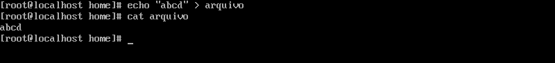

<h2 p align="center" > STREAMS </h2>

## Passo 1 - STANDARD INPUT.

 Geralmente STDIN é a entrada de dados pelo teclado, mas também pode ser reconhecido por <b>"0<"</b> ou apenas <b>"<" </b> que pode ser utilizado para passar arquivos como input ao invés da entrada padrão do teclado.

 Na prática é como se tivessemos feito "cat numeros", mas de forma tecnica nós passamos o valor de input que é numeros para o comando cat. 

 Podemos utilizar outros comandos que esperam um input como sort. 

 Por sua vez pode ser continuado o comando com outras estruturas como pipe, colocando os números em ordem e mostrando apenas os números de forma única do conteudo arquivo números. 

## Passo 2 - STANDARD OUTPUT.

 Podemos identificar STDOUT como <b>"1>"</b> ou <b>">"</b>, onde atráves de um input direcionamos para uma saída padrão. 

 STDOUT difere do STDERR que falaremos mais a frente, para reconhecer uma saída bem sucedida fora de um script podemos utilizar o comando "echo $?" logo em sequência. 

 Saída do comando "echo $? for "0" quer dizer que o comando foi bem sucedido e é uma saída padrão. Qualquer número diferente do 0 é uma saída de erro (STDERR). 

 Observe que usamos > para sobreescrever um arquivo e >> para adicionar algo uma linha abaixo do arquivo direcionado. 

 Neste exemplo a primeira vez que utilizamos o comando cat no arquivo a nossa saída abcd. 

 Podemos ver que utilizando o ">" com os valores 123 nós sobrescrevemos o conteúdo anterior do arquivo e sua nova saída com o cat é "123".

 Já utilizando ">>" com o conteúdo abcd, podemos ver que adicionamos esse novo texto abaixo do último conteúdo existente no arquivo. E sua nova saída fica:  123 abcd  Esta são as diferenças utilizando > e >>. 

## Passo 3 - STANDARD ERROR.

 Qualquer saída que gere um erro é considerado STDERR. 

 No primeiro comando "ls" temos uma saída bem sucedida, mostrando os arquivos no diretório que estamos. 

 Agora no nosso segundo comando utilizamos uma flag que não existe "-j", nos dando uma saída de erro. 

 Utilizamos o 2> para redirecionar a saída de erro para um arquivo. Da mesma forma que a STDOUT, podemos usar 2> e 2>>, para sobrescrever e adicionar respectitivamente. 

## Passo 4 - REDIRECIONANDO SAÍDAS.

 No exemplo asseguir criei um simples script com o seguinte conteúdo:   
echo "Hello" 
ls -j  

Ao executa-lo teremos ambas as saídas, STDOUT e STDERR. 

 Se tentarmos redirecionar a saída como STDOUT para um arquivo, teriamos um problema. 

 Perceba que ao direcionar a saída do script para o arquivo saida.txt ainda continuamos com o erro em questão como output do comando, e ao utilizar o cat no arquivo saida.txt notamos que apenas a saída bem sucedida foi salva dentro dele. 

 Podemos ter o resutado oposto utilizando uma saida STDERR "2>", agora o conteúdo de uma saída de erro foi salvo no arquivo saidaerr.txt e a saída bem sucedida apareceu no terminal sendo a string "Hello". 

 Mas como podemos salvar ambas as saídas em um arquivo só, ou melhor salvar cada saída em seu respectitivo tipo. 

 Podemos utilizar a seguinte lógica a seguir. 

 Caso queira salvar ambas as saídas em um arquivo só utilizamos a seguinte estrtura:  
./script.sh > saida_e_saidaerr.txt, onde eu direciono o conteudo da saída bem sucedidade para o arquivo em questão e ao final da sintaxe eu estou pedindo para que a saida de erro também seja direcionada para a saída bem sucedida com o comando 2>&1. 

 Desta forma com o comando cat podemos ver que salvamos os dois tipos de saída em um arquivo só. 

 Utilizando > e 2> podemos direcionar cada tipo de saída para um determinado arquivo como no exemplo acima. 

## Passo 5 - HEREDOCS.

 Existem situações em que precisamos escrever scripts simples de mais de uma linha sem precisar entrar dentro de um editor de texto, podemos para isso utilizar o HereDocs. 

 Esta seria uma forma lenta e repetitiva de inserir linha após linha dentro de um arquivo atráves do append, o que a torna inviavel para a maioria das situações. 

 Utilizando o heredocs isso fica bem mais simples e dinâmico. Sua estrutura é simples. Você consegue digitar multiplas linhas utilizando o << (Heredocs), a palavra EOF vem dos primórdios da computação que significa End of file, que é uma palavra chave que indica o começo e fim da sua inserção de texto no Heredocs. 

 Agora vamos entender a funcionalidade desse comando, note que todo o input do "<<" é destinado para o comando cat que por sua vez é direcionado como uma saída padrão para o arquivo texto_heredocs. 

 Utilizando o comando cat texto_heredocs podemos ver que todo o texto foi inserido no arquivo de texto atráves desse fluxo 
