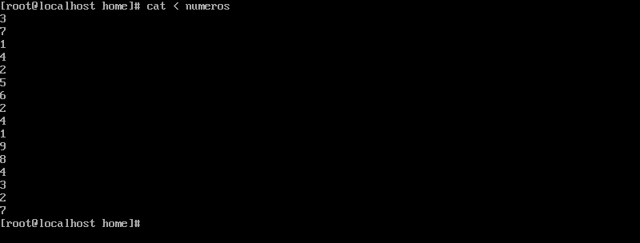
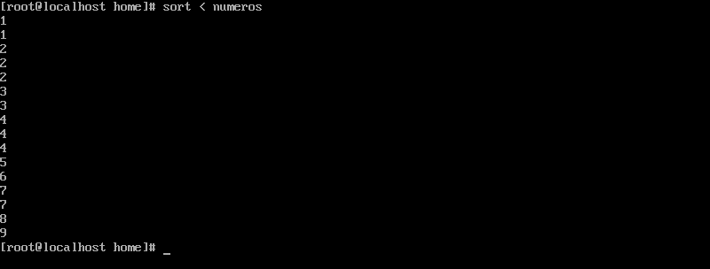
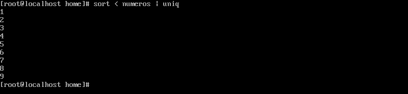
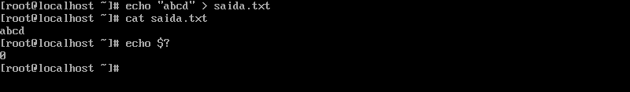
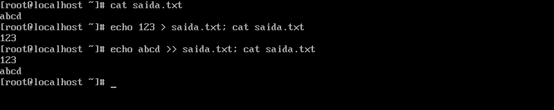
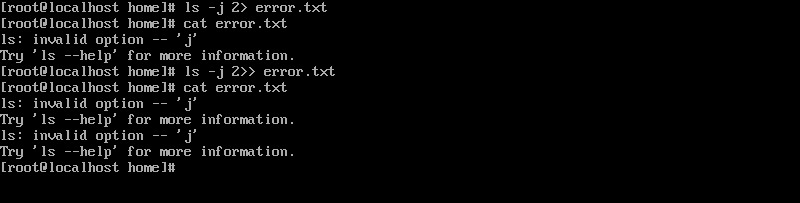
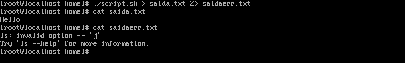
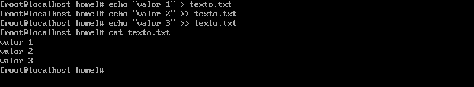
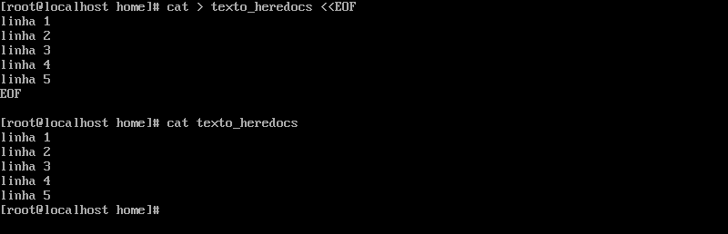

<h2 p align="center" > STREAMS </h2>

## Passo 1 - STANDARD INPUT (STDIN).

 - Geralmente STDIN é a entrada de dados pelas teclas do teclado, mas também pode ser reconhecido por <b>"0<"</b> ou apenas <b>"<" </b> que pode ser utilizado para passar arquivos como input ao invés da entrada padrão.

 - Na prática é como se tivéssemos utilizado o comando <b>"cat números"</b>, mas neste exemplo utilizamos o arquivo números como input para o cat. 

 - Podemos utilizar outros comandos que esperam um input como por exemplo, <b>sort</b>. 

 - O fluxo pode ser continuado com outras estruturas de saída, como pipe. No exemplo ordenando os números e não mostrando repetições. 

## Passo 2 - STANDARD OUTPUT (STDOUT).

 - Podemos identificar STDOUT como a saída bem sucedida, também identificada pelos comandos <b>"1>"</b> ou <b>">"</b>, onde através de um input direcionamos ele com o objetivo de uma saída bem sucedida. 

 - STDOUT difere do STDERR que falaremos mais a frente, para reconhecer uma saída bem sucedida fora de um script podemos utilizar o comando "echo $?" logo em sequência de um comando. 

 - Quando a saída do comando <b>"echo $?</b> for <b>"0"</b> mostra que o comando foi bem sucedido, sendo uma STDOUT. Qualquer número diferente do 0 é uma saída de erro (STDERR). 

 - Observe que usamos <b>></b> para sobrescrever um arquivo e <b>>></b> para adicionar algo uma linha abaixo do arquivo direcionado. 

 - Neste exemplo a primeira vez que utilizamos o comando cat no arquivo saida.txt o nosso output é abcd. 

 - Pode-se notar que utilizando o <b>">"</b> com os valores 123 nós sobrescrevemos o conteúdo anterior do arquivo e sua nova saída com o cat é "123".

 - Já utilizando <b>">>"</b> com o conteúdo "abcd", podemos ver que adicionamos esse novo texto abaixo do último conteúdo existente no arquivo saida.txt.

 - Sua nova saída fica:  123 abcd 

## Passo 3 - STANDARD ERROR (STDERR).

 Qualquer saída que resulte em um erro é considerado um STDERR. 

 - No primeiro comando "ls" temos uma saída bem sucedida, mostrando os arquivos no diretório que estamos. 

 - Agora no nosso segundo comando utilizamos a flag "-j", que não existe, nos dando uma saída de erro. 

 - Utilizamos o <b>2></b> para redirecionar a saída de erro para um arquivo. Da mesma forma que a STDOUT, podemos usar <b>2></b> e <b>2>></b>, para sobrescrever e adicionar respectivamente.. 

## Passo 4 - REDIRECIONANDO SAÍDAS.

 - No exemplo a seguir criei um simples script com o seguinte conteúdo:   
echo "Hello" 
ls -j  

 - Ao executa-lo teremos ambas as saídas, STDOUT e STDERR. 

 - Se tentarmos redirecionar a saída como STDOUT para um arquivo, teríamos um problema. 

 - Perceba que ao direcionar a saída do script para o arquivo saida.txt ainda continuamos com o erro em questão como output do comando, e ao utilizar o cat no arquivo saida.txt notamos que apenas a saída bem sucedida foi salva dentro dele. 

 - Podemos ter o resultado oposto utilizando uma saída STDERR "2>", agora o conteúdo de uma saída de erro foi salvo no arquivo saidaerr.txt e a saída bem sucedida apareceu no terminal sendo a string "Hello". 

 - Mas como podemos salvar ambas as saídas em um arquivo só, ou melhor salvar cada saída em seu respectitivo tipo. 

 - Podemos utilizar a lógica a seguir. 

 - Caso queira salvar ambas as saídas em um arquivo só utilizamos a seguinte estrutura: "./script.sh > saida_e_saidaerr.txt, onde direciona-se o conteúdo da saída bem sucedida para o arquivo em questão e ao final da sintaxe eu estou pedindo para que a saída de erro também seja direcionada para a saída bem sucedida com o comando <b>2>&1.</b>" 

 - Desta forma com o comando cat podemos ver que salvamos os dois tipos de saída em um arquivo só. 

 - Utilizando > e 2> podemos direcionar cada tipo de saída para um determinado arquivo como no exemplo acima. 

## Passo 5 - HEREDOCS.

 - Existem situações em que precisamos escrever scripts simples contendo mais de uma linha sem precisar acessar um editor de texto, podemos para isso utilizar o <b>HereDocs</b>. 

 - Esta seria uma não usual de inserir linha após linha dentro de um arquivo através do append. 

 - Utilizando o <b>HereDocs</b> isso fica bem mais simples e dinâmico. Sua estrutura é simples. 

 Consegue-se digitar múltiplas linhas utilizando o <b><<</b>, seguido de uma palavra-chave para determinar o começo e fim do comando. Utilizamos a palavra EOF que vem dos primórdios da computação, que significa End of file. 

 - Agora vamos entender a funcionalidade desse comando, note que todo o input do "<<" é destinado para o comando cat que por sua vez é direcionado como uma saída padrão para o arquivo texto_heredocs. 

 - Utilizando o comando cat texto_heredocs podemos ver que todo o texto foi inserido no arquivo através desse fluxo. 
